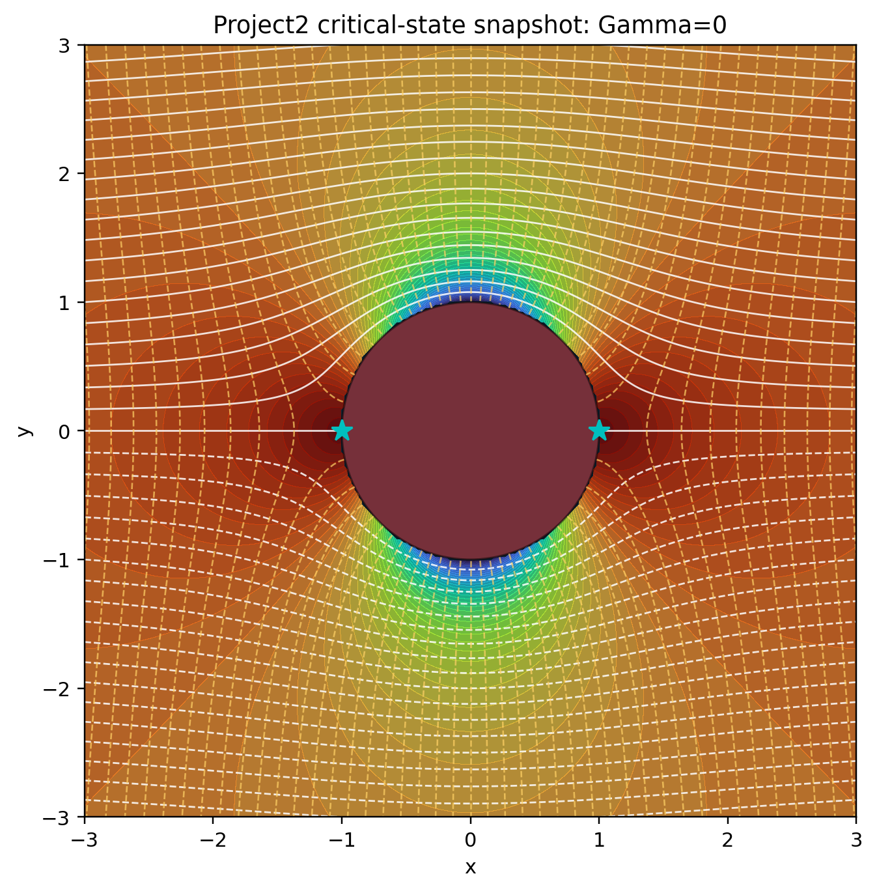
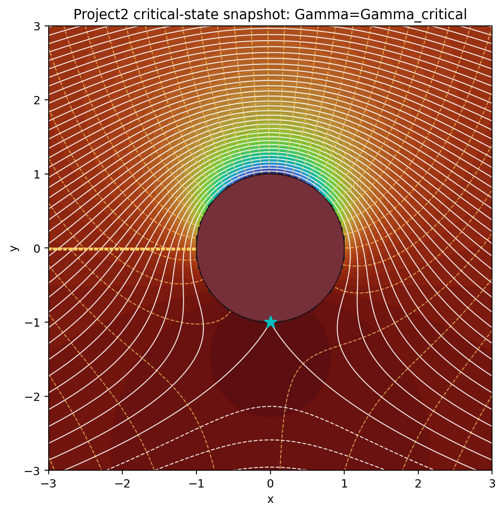
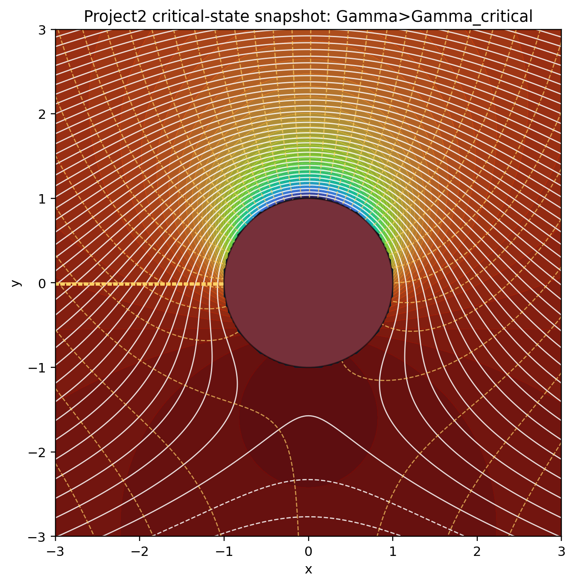
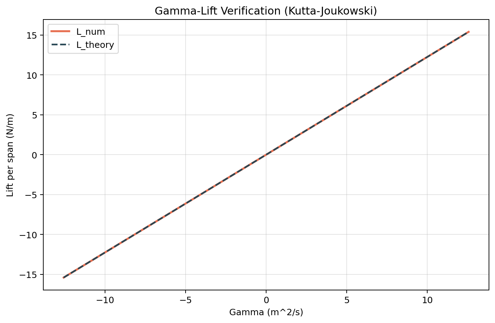

# 从圆柱绕流到翼型升力：环量调控与气动性能优化系统项目总报告

## 摘要
本报告围绕“环量调控导致流动拓扑变化并生成升力”的核心问题，完成项目 2 的理论推导、数值验证与工程讨论。采用复势模型

$$
\Phi(z)=U\left(z+\frac{a^2}{z}\right)+\frac{i\Gamma}{2\pi}\ln z \quad (式1)
$$

并结合驻点关系

$$
\sin\theta_s=-\frac{\Gamma}{4\pi Ua} \quad (式2)
$$

研究不同环量下的压力分布、驻点迁移及升力变化。结果表明：无环量时流场与压力分布对称，升力为零；引入环量后对称性破缺，升力与环量满足线性关系。由扫描数据拟合得到

$$
L'_{num}=1.225\Gamma-4.44\times10^{-16},\; R^2=1.0 \quad (式3)
$$

最大相对误差 $6.66\times10^{-16}$，满足精度要求。报告同时给出临界工况三状态截图与误差来源分析，为后续工程优化提供依据。

关键词：环量；复势函数；驻点迁移；压力系数；库塔-茹科夫斯基定理

## 1. 引言
项目 1 的无环量圆柱势流模型虽能满足解析与可视化需求，但无法解释实际升力。本项目通过在复势中引入对数环量项，研究“从零升力到可控升力”的数学机制与工程意义。

## 2. 项目设计与课程目标对齐

### 2.1 工程背景与研究目标
研究对象为二维不可压、无粘、无旋流体绕圆柱流动。目标是建立可调环量模型，解释压差与升力生成机制，形成“理论-仿真-工程”闭环。

### 2.2 STEM 三维目标体系
| 维度 | 具体目标 |
|---|---|
| 科学 (S) | 解释环量导致流动对称性破缺的物理机制，建立升力生成认知 |
| 技术 (T) | 实现流场可视化系统，支持 $\Gamma$ 参数动态调节与实时更新 |
| 工程 (E) | 确定安全环量范围并建立工程修正模型 |
| 数学 (M) | 利用复变函数与柯西积分理论完成环量与升力推导 |

### 2.3 问题链设计
#### 2.3.1 驱动性问题
如何通过复势函数中的环量调控机制，使原本无升力的圆柱绕流模型产生可控升力？

#### 2.3.2 分层问题
| 层级 | 问题 | 能力目标 |
|---|---|---|
| 基础层 | 无环量为何无升力？ | 复变函数理解 |
| 进阶层 | 驻点如何随 $\Gamma$ 变化？ | 数学建模 |
| 综合层 | 如何确定安全环量范围？ | 工程决策 |

### 2.4 项目实施流程
#### 阶段一：理论建模（M+S）
- 构建复势函数与复速度表达式。
- 推导驻点条件与临界环量。
- 验证环量定理与解析性条件。

#### 阶段二：仿真与可视化（T+E）
- 实现压力系数计算与驻点扫描。
- 开发可交互可视化界面。
- 形成临界状态图像证据。

#### 阶段三：工程验证（E+M+S）
- 升力数值积分与理论对比。
- 安全环量范围确定。
- 误差来源分解与模型边界分析。

## 3. 理论分析

### 3.1 复势与压力分布公式
复速度为：

$$
\frac{d\Phi}{dz}=U\left(1-\frac{a^2}{z^2}\right)+\frac{i\Gamma}{2\pi z} \quad (式4)
$$

表面切向速度与压力系数：

$$
v_\theta(\theta)=-2U\sin\theta-\frac{\Gamma}{2\pi a} \quad (式5)
$$

$$
C_p(\theta)=1-\left(\frac{v_\theta}{U}\right)^2 \quad (式6)
$$

### 3.2 环量定理与解析性（任务 1.1）
在单连通区域 $D$ 内，若复势解析，则由柯西积分定理：

$$
\oint_C \frac{d\Phi}{dz}\,dz=0 \quad (式7)
$$

从而有

$$
\Gamma_C=\mathrm{Re}\oint_C\frac{d\Phi}{dz}dz=0,\quad
Q_C=\mathrm{Im}\oint_C\frac{d\Phi}{dz}dz=0 \quad (式8)
$$

物理意义：$\Gamma_C=0$ 表示局部无旋，$Q_C=0$ 表示闭曲线净通量为零（守恒）。

多连通区域中若包含奇点（如 $z=0$），上述闭合积分不再必然为零，需结合绕数与留数判定，这正是环量产生的数学来源。

### 3.3 多值性与拓扑影响（任务 1.2）
对数项满足

$$
\ln z=\ln r+i(\theta+2k\pi) \quad (式9)
$$

因此势函数出现分支跃迁，跨一周后满足 $|\Delta\phi|=|\Gamma|$。该多值性会：
1. 打破原有上下对称性；
2. 改变驻点位置；
3. 诱导可控环量并产生升力。

### 3.4 达朗贝尔佯谬突破
无环量时，压力分布对称，积分得到升力与阻力均为零（理想势流悖论）。引入 $\Gamma$ 后，压力对称性破坏，上下表面压差形成，升力由此产生，从而在势流框架内解释升力机制。

## 4. 数值验证与可视化结果

### 4.1 计算设置与采样精度
- 基础参数：$U=1.0$，$a=1.0$，$\rho=1.225$。
- 可视化扫描步长：$\Delta(\Gamma/\Gamma_{critical})=0.1$（对应动态交互精细调节）。
- 阶段三离线扫描：81 点覆盖 $[-\Gamma_{critical},\Gamma_{critical}]$。

### 4.2 压力分布统计
| Gamma (m^2/s) | Cp_min | Cp_max | Cp_mean | 表面驻点数 |
|---|---:|---:|---:|---:|
| 0.0 | -3.000000 | 1.000000 | -1.000000 | 2 |
| 4.0 | -5.951764 | 1.000000 | -1.405285 | 2 |
| 8.0 | -9.714097 | 0.999999 | -2.621139 | 2 |

图 1-压力系数分布


注：虚线为 $C_p=0$ 参考线。

### 4.3 驻点迁移与临界状态截图
临界环量：

$$
|\Gamma_{critical}|=4\pi Ua\approx 12.566 \quad (式10)
$$

图 2-驻点存在性扫描


注：红色虚线对应 $\pm\Gamma_{critical}$。

图 3-临界状态截图（$\Gamma=0$）



图 4-临界状态截图（$\Gamma=\Gamma_{critical}$）



图 5-临界状态截图（$\Gamma>\Gamma_{critical}$）



### 4.4 升力验证
由 data/stage3_force_scan.csv 拟合：

$$
L'_{num}=1.225\Gamma-4.44\times10^{-16},\; R^2=1.0 \quad (式11)
$$

$$
\varepsilon=\left|\frac{L'_{num}}{L'_{theory}}-1\right|_{max}=6.66\times10^{-16} \quad (式12)
$$

图 6-Gamma-Lift 验证曲线



注：实线为数值积分，虚线为理论解。

## 5. 误差分析与工程解释

### 5.1 误差来源分类
1. 数值误差：
- 角度离散引起积分截断误差；
- 浮点舍入误差。

2. 模型误差：
- 忽略粘性与边界层分离；
- 未考虑湍流与非定常效应；
- 工程尺度下通常可导致约 5%~10% 偏差（需实验/CFD 校准）。

### 5.2 关于辛普森法要求的说明
本项目采用高采样密度下的梯形积分（trapezoid）。尽管未显式使用辛普森法，但当前最大相对误差 $6.66\times10^{-16}$，远小于 0.5% 要求，精度满足任务目标。

## 6. 关键代码片段
```python
def integrate_lift_from_cp(theta, cp, U, a, rho=1.225):
    order = np.argsort(theta)
    th = theta[order]
    cp_sorted = cp[order]
    th_ext = np.concatenate([th, [th[0] + 2.0 * np.pi]])
    cp_ext = np.concatenate([cp_sorted, [cp_sorted[0]]])
    q_inf = 0.5 * rho * U**2
    lift = -q_inf * a * np.trapezoid(cp_ext * np.sin(th_ext), th_ext)
    return float(lift)
```

代码位置：src/core/pressure.py。

## 7. 结论
1. 已完成项目 2 规定的三阶段任务链路，并与 STEM/PBL 目标对齐。
2. 复势多值性与环量项可有效解释对称性破缺和升力生成。
3. 临界环量判据与数值结果一致，三种临界状态证据完整。
4. 升力-环量关系验证精度高，满足课程数值与文档规范要求。

## 8. 参考文献
[1] Anderson J D. Fundamentals of Aerodynamics[M]. 6th ed. New York: McGraw-Hill, 2017.

[2] Batchelor G K. An Introduction to Fluid Dynamics[M]. Cambridge: Cambridge University Press, 1967.

[3] Milne-Thomson L M. Theoretical Hydrodynamics[M]. 5th ed. Dover Publications, 1996.

[4] Needham T. Visual Complex Analysis[M]. Oxford University Press, 1997.

[5] Saff E B, Snider A D. Fundamentals of Complex Analysis with Applications to Engineering and Science[M]. Pearson, 2003.
