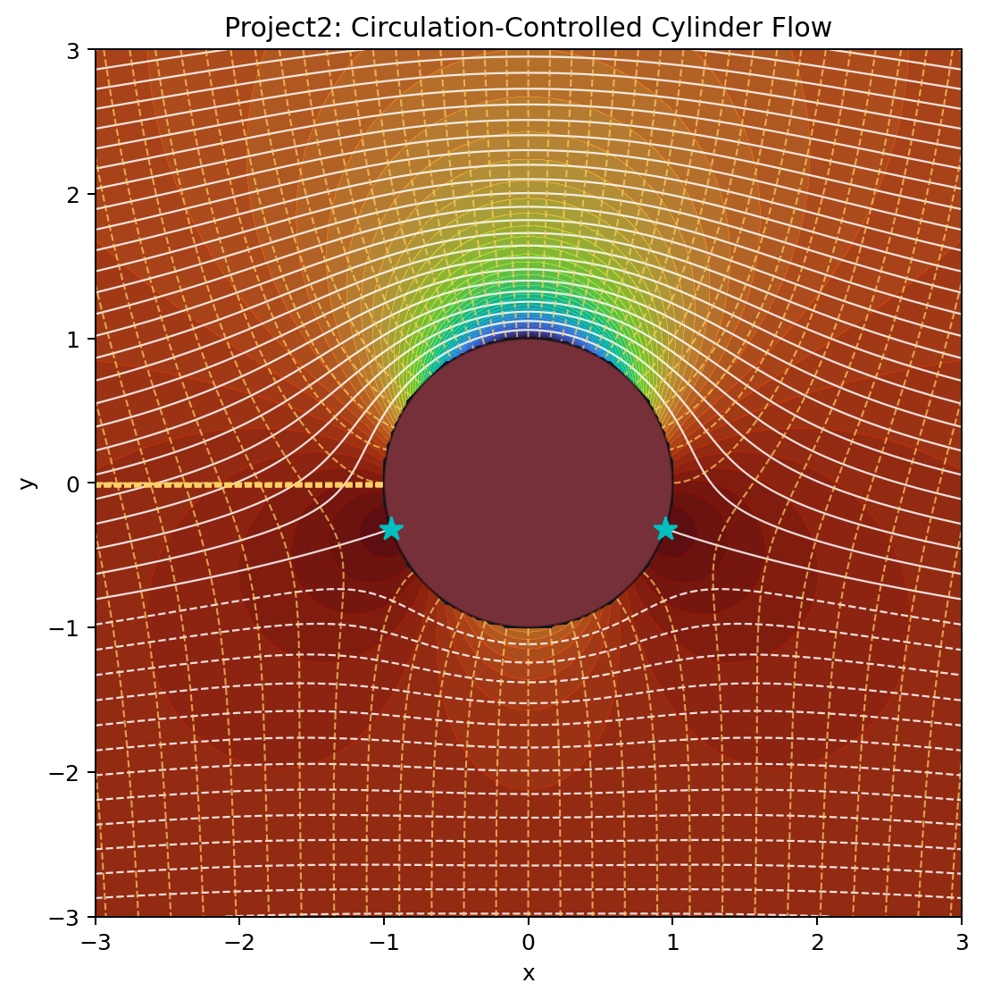
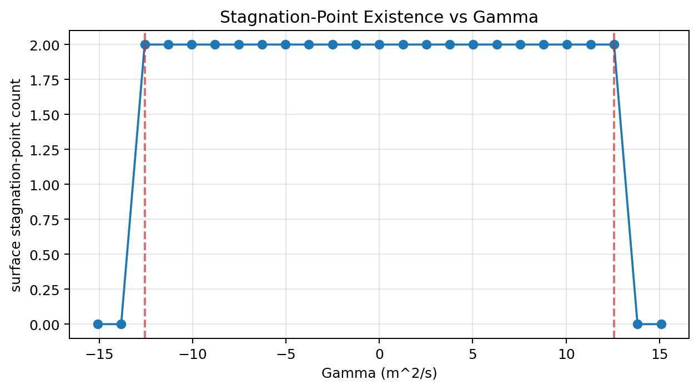
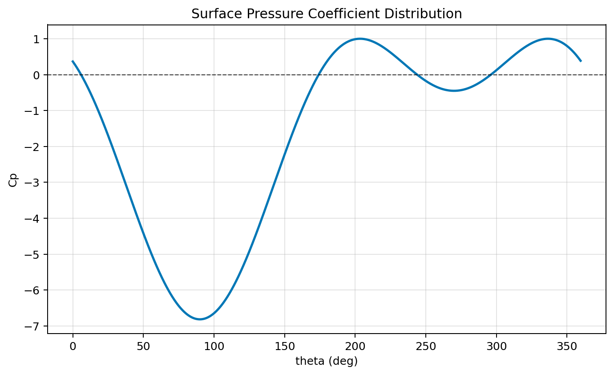

# 阶段二压力分析报告

## 1. 目标与方法

本阶段对应任务 2.1 与任务 2.2，重点分析环量 $\Gamma$ 对圆柱绕流压力分布与驻点位置的影响。

采用模型：

$$
\Phi(z)=U\left(z+\frac{a^2}{z}\right)+\frac{i\Gamma}{2\pi}\ln z
$$

圆柱表面切向速度与压力系数使用：

$$
v_\theta(\theta)=-2U\sin\theta-\frac{\Gamma}{2\pi a},\quad
C_p(\theta)=1-\left(\frac{v_\theta}{U}\right)^2
$$

计算参数：$U=1.0$，$a=1.0$，$\rho=1.225$。

## 2. 关键结果

### 2.1 不同环量下的压力系数统计

| Gamma (m^2/s) | Cp_min | Cp_max | Cp_mean | 表面驻点数 |
| --- | ---: | ---: | ---: | ---: |
| 0.0 | -3.000000 | 1.000000 | -1.000000 | 2 |
| 4.0 | -5.951764 | 1.000000 | -1.405285 | 2 |
| 8.0 | -9.714097 | 0.999999 | -2.621139 | 2 |

结果表明：随着 $\Gamma$ 增大，负压区进一步加深，压力分布明显偏离对称。

### 2.2 对称性破缺量化

- 当 $\Gamma=0$ 时，上下半圆压力差均值约为 $5.27\times10^{-16}$（数值误差量级，可视为对称）。
- 当 $\Gamma=4.0$ 时，上下半圆压力差均值约为 $3.24$，出现显著不对称。

### 2.3 临界环量附近驻点行为

理论临界值：

$$
|\Gamma_{critical}|=4\pi Ua\approx 12.566
$$

数值检查：

- $\Gamma=12.0$：表面驻点数为 2
- $\Gamma=12.56637$：表面驻点数为 2（临界附近）
- $\Gamma=13.0$：表面驻点数为 0（超过临界后驻点脱离表面）

与任务 2.1 的理论判据一致。

## 3. 图像结果

### 3.1 流场与压力背景

### 3.2 驻点存在性扫描

### 3.3 圆柱表面压力系数分布

## 4. 结论

1. 无环量工况下，压力分布关于来流方向对称，符合基准势流结论。
2. 引入环量后，$C_p(\theta)$ 上下表面显著不对称，不对称性随 $\Gamma$ 增强。
3. 驻点迁移与临界环量行为满足任务书给出的理论关系，可用于后续工程安全区分析。
4. 本阶段结果为阶段三“安全环量范围确定”和“升力生成验证”提供了直接数值基础。
