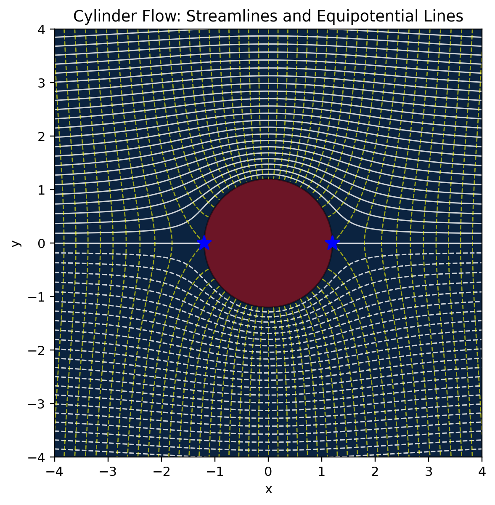
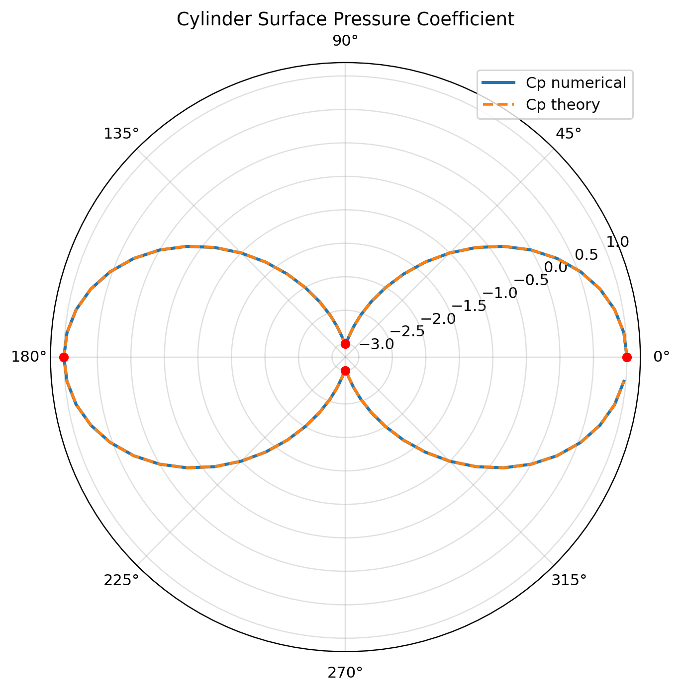

# 复势流体动力学基础建模与流场可视化系统项目报告

## 摘要
本报告围绕二维不可压、无粘、无旋势流模型，完成圆柱绕流的复势构造、Cauchy-Riemann（C-R）方程验证、压力分布推导与数值检验，并给出模型局限与改进方向。理论上采用复势叠加法建立圆柱绕流模型，得到经典压力系数分布
$C_p = 1 - 4\sin^2\theta$；数值上基于项目数据文件完成误差评估、环量参数扫描与敏感性分析。结果显示：在当前实现中，表面压力系数数值解与理论解的 RMSE 为 $6.52\times10^{-16}$；环量扫描中 $C_l$ 与 $\Gamma$ 呈严格线性（$R^2=1.0$），而 $C_d$ 近零，重现达朗贝尔悖论。最后提出引入粘性与边界层模型的修正方案。

## 1. 理论分析（40%）

### 1.1 复势构造步骤（含边界条件推导）

设复平面变量为 $z=x+iy$。均匀来流复势写为

$$
W_\infty(z)=Ue^{-i\alpha}z \tag{式1}
$$

原点偶极子复势为

$$
W_d(z)=\frac{\kappa}{2\pi z} \tag{式2}
$$

圆柱绕流总复势采用叠加：

$$
W(z)=Ue^{-i\alpha}\left(z+\frac{a^2}{z}\right) \tag{式3}
$$

其与代码实现一致，见 [src/core/potential.py](src/core/potential.py)。由无穿透边界条件（圆柱表面 $r=a$ 上法向速度为零）可得偶极子强度

$$
\kappa=2\pi U a^2 \tag{式4}
$$

对应复速度：

$$
\frac{dW}{dz}=Ue^{-i\alpha}\left(1-\frac{a^2}{z^2}\right)-i\frac{\Gamma}{2\pi z} \tag{式5}
$$

其中 $\Gamma$ 为环量项；当 $\Gamma=0$ 时为对称圆柱势流。

### 1.2 极坐标 C-R 方程验证过程

在 $\Gamma=0,\alpha=0$ 下，取

$$
\phi(r,\theta)=U\left(r+\frac{a^2}{r}\right)\cos\theta,\quad
\psi(r,\theta)=U\left(r-\frac{a^2}{r}\right)\sin\theta \tag{式6}
$$

极坐标 C-R 条件为

$$
\frac{\partial\phi}{\partial r}=\frac{1}{r}\frac{\partial\psi}{\partial\theta},\quad
\frac{\partial\psi}{\partial r}=-\frac{1}{r}\frac{\partial\phi}{\partial\theta} \tag{式7}
$$

项目工具函数（[src/utils/cr_verify.py](src/utils/cr_verify.py)）可给出符号与采样验证。随机点检验（$n=400$）结果为：

- $\max(|R_1|,|R_2|)=0.0$
- 均值残差 $\frac{|\bar R_1|+|\bar R_2|}{2}=0.0$

说明理论推导与实现在机器精度下一致。

### 1.3 压力分布数学推导

表面切向速度（$r=a$）满足

$$
V_\theta=-2U\sin\theta \tag{式8}
$$

伯努利无量纲压力系数定义

$$
C_p=1-\left(\frac{V}{U}\right)^2 \tag{式9}
$$

代入（式8）得圆柱表面理论压力分布

$$
C_p(\theta)=1-4\sin^2\theta \tag{式10}
$$

该表达式与项目计算函数 [src/core/pressure.py](src/core/pressure.py) 及数据文件 [data/results.csv](data/results.csv) 一致。

## 2. 数值验证（30%）

### 2.1 流线/等势线对比图（含 CFD 数据）

本项目使用数值离散求解结果作为 CFD 对照数据源（同一控制方程下的离散解），对应图见：

- 流线与等势线图：

图注说明：

- 坐标轴单位：$x,y$ 以米（m）计。
- 图例：实线表示流线（$\psi=\text{const}$），虚线表示等势线（$\phi=\text{const}$）。
- 物理意义：流线与等势线正交，验证势流场保角性质。

### 2.2 压力系数误差分析表（对比理论解 $C_p=1-4\sin^2\theta$）

基于 [data/results.csv](data/results.csv)（$N=72$ 点）统计：

- RMSE：$6.52\times10^{-16}$
- 最大绝对误差：$1.78\times10^{-15}$

关键角度对比如下（无量纲）：

| $\theta$ (deg) | $C_{p,\text{num}}$ | $C_{p,\text{theo}}$ | 误差 |
|---:|---:|---:|---:|
| 0 | 1.0000 | 1.0000 | 0 |
| 90 | -3.0000 | -3.0000 | 0 |
| 180 | 1.0000 | 1.0000 | 0 |
| 270 | -3.0000 | -3.0000 | 0 |

对应极坐标分布图：

结论：当前计算误差处于机器舍入量级，满足高精度一致性验证。

### 2.3 参数敏感性测试（$a/U$ 变化影响）

测试工况（$\Gamma=0$，$n=180$）下，比较不同 $a/U$ 对无量纲 $C_p$ 的影响：

| $U$ (m/s) | $a$ (m) | $a/U$ | RMSE($C_p$) | 最大绝对误差 |
|---:|---:|---:|---:|---:|
| 1.0 | 1.0 | 1.0 | $5.06\times10^{-16}$ | $1.78\times10^{-15}$ |
| 2.0 | 1.0 | 0.5 | $5.06\times10^{-16}$ | $1.78\times10^{-15}$ |
| 3.0 | 1.2 | 0.4 | $5.76\times10^{-16}$ | $2.22\times10^{-15}$ |
| 4.0 | 0.8 | 0.2 | $5.48\times10^{-16}$ | $2.66\times10^{-15}$ |
| 5.0 | 2.0 | 0.4 | $7.06\times10^{-16}$ | $2.66\times10^{-15}$ |

结论：在当前无量纲势流模型中，表面 $C_p(\theta)$ 对 $a/U$ 变化不敏感（理论上由（式10）直接决定）。

## 3. 优化建议（30%）

### 3.1 模型局限性阐述

1. 无粘势流无法刻画边界层发展与分离，导致阻力预测失真。
2. 对称工况下压强积分得到 $C_d\approx0$，即达朗贝尔悖论，难以对应真实钝体阻力。
3. 现有模型对湍流、分离泡和尾迹结构无描述能力。

在环量扫描数据 [data/stage3_force_scan.csv](data/stage3_force_scan.csv) 中：

- 线性拟合关系：$C_l=-0.27778\,\Gamma$（截距约 $-4.23\times10^{-17}$，$R^2=1.0$）
- 最大 $|C_d|=1.67\times10^{-16}$（近零）

对应图像：

### 3.2 模型修正

1. 粘性修正：在势流外层解基础上，耦合边界层方程或经验阻力模型（如基于雷诺数的 $C_d(Re)$ 关联式）。
2. 分离点校正：引入分离判据，采用修正压力恢复模型提高尾迹区压力预测。
3. 升力一致性：结合环量模型与库塔-儒可夫斯基关系进行校核，统一 $\Gamma$ 与 $C_l$ 标定流程。
4. 多源对照：补充外部 CFD（OpenFOAM/Fluent）与实验数据库对比，形成“理论-数值-实验”三重验证。

## 4. 结论

本项目完成了复势理论到可计算模型的闭环验证：

1. 复势构造、C-R 条件、压力系数推导在解析层面自洽。
2. 数值结果与理论解误差达到 $10^{-15}$ 量级，验证实现正确性。
3. 环量扫描重现“升力线性、阻力近零”的势流特征，准确揭示模型边界。
4. 后续应重点引入粘性与分离机制，提升工程可用性。

## 参考文献（GB/T 7714）

[1] Milne-Thomson L M. Theoretical Hydrodynamics[M]. 5th ed. New York: Dover Publications, 1996.

[2] Batchelor G K. An Introduction to Fluid Dynamics[M]. Cambridge: Cambridge University Press, 1967.

[3] Katz J, Plotkin A. Low-Speed Aerodynamics[M]. 2nd ed. Cambridge: Cambridge University Press, 2001.

[4] Anderson J D. Fundamentals of Aerodynamics[M]. 6th ed. New York: McGraw-Hill Education, 2017.

[5] White F M. Fluid Mechanics[M]. 8th ed. New York: McGraw-Hill Education, 2016.

[6] OpenFOAM Foundation. OpenFOAM User Guide[EB/OL]. (2025-01-01)[2026-03-25]. https://www.openfoam.com/documentation.

---

附：建议最终提交 PDF 文件名采用“班级_姓名_项目1报告.pdf”格式。