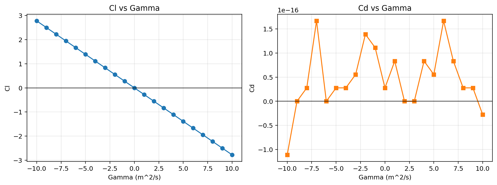

# 阶段 3.1 气动力悖论与环量修正分析

## 工况参数
- U = 3.0
- a = 1.2
- rho = 1.225

## 理想模型验证（Gamma=0）
- Fx' = 3.672063e-16 N/m
- Fy' = -0.000000e+00 N/m
- Cd = 2.775558e-17
- Cl = -0.000000e+00

结论：理想势流模型预测阻力约为 0，升力约为 0（对称工况），体现达朗贝尔悖论。

## 环量修正预研
- 通过引入 Gamma，升力系数 Cl 随 Gamma 呈近线性变化。
- 阻力系数 Cd 仍接近 0，说明仅靠无粘势流+环量仍无法预测真实阻力。

## 图像

## 模型局限与后续方向
- 局限：当前模型不含粘性和边界层分离，无法给出实际阻力。
- 修正思路：可引入库塔-儒可夫斯基关系评估升力，并结合粘性模型/经验阻力模型改进阻力预测。
